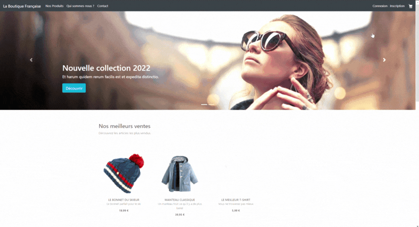
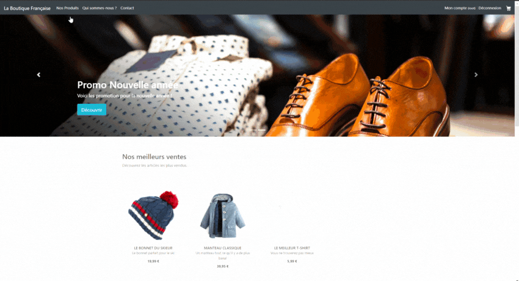
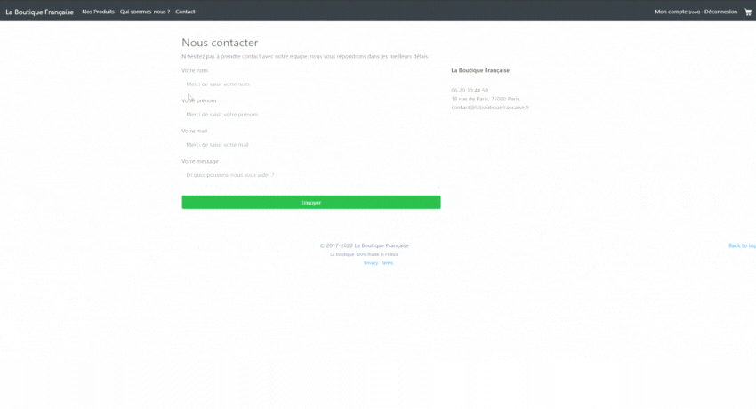

# La-Boutique-Française---Symfony5

Site réalisé sous Symfony - Toutes les fonctionnalités sont codés de A à Z !

CSS/HTML/JS réalisé avec Bootstrap.

Petit aperçu :

Fonctionnalité du site :

1. Users :

- Formulaire d'inscription Utilisateur
- Encodage de mot de passe
- Espace Utilisateurs
- Modification mot de passe
- Conexion/Déconnexion

2. Adminitration :

- Utilisation d'un BackOffice avec Easy Admin
- Ajout/Edition/Suppression des produits via le backoffice
- Ajout de catégories supplémentaires
- Ajout de compte ROLE_ADMIN

3. Les produits/paniers :

-  Ajout de produit en Top list sur le site 
-  Carrousel avec possibilité de modifier les images
-  Ajout d'un panier (nombres d'articles, quantité, total)

4. Pour aller plus loins :

- Ajout d'un espace "nous contacter"

